# Our training environment
- CPU: Intel(R) Core(TM) i5-10400 CPU @ 2.90GHz
- GPU: NVIDIA GeForce RTX 3060
- Memory: 8G
- OS: Ubuntu 20.04.4
- Python version: 3.8.10
- GPU Driver Version: 515.65.01
- CUDA Version: 11.7

# Result
## git-e3bb9ce_jnetpcap-1.4.r1500_patch
Latest Commit Date: Mon Jul 25 22:30:07 2022 +0200

  
  
  
  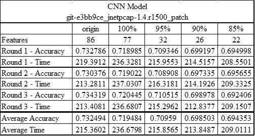
  
  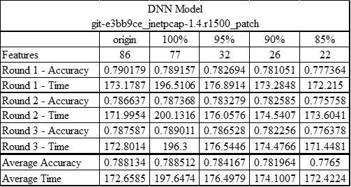
  
  

## git-e3bb9ce_jnetpcap-1.4.r1500
Latest Commit Date: Mon Jul 25 22:30:07 2022 +0200

  
  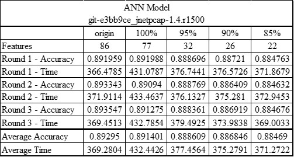
  
  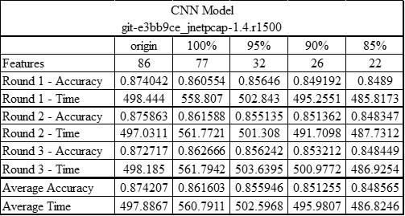
  
  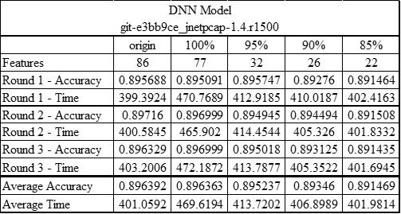
  
  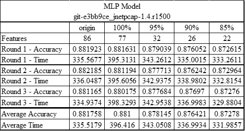

## git-e3bb9ce_jnetpcap-1.4.r1425_patch
Latest Commit Date: Mon Jul 25 22:30:07 2022 +0200

  
  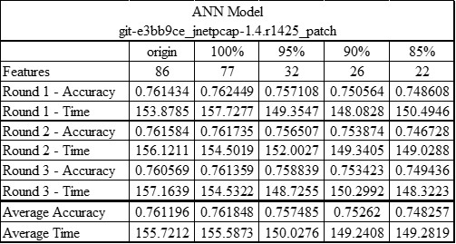
  
  
  
  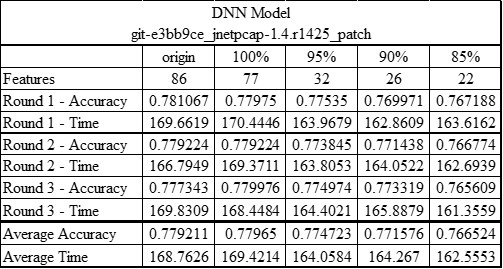
  
  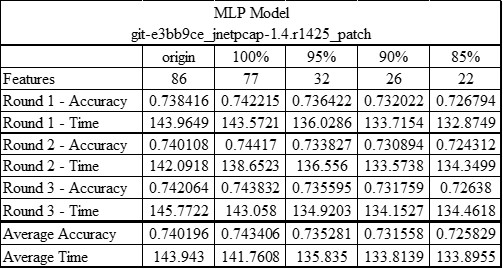

## git-e3bb9ce_jnetpcap-1.4.r1425
Latest Commit Date: Mon Jul 25 22:30:07 2022 +0200

  
  
  
  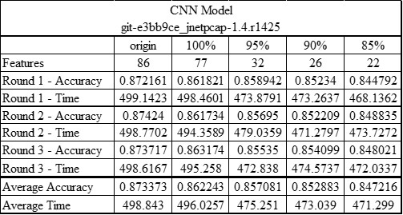
  
  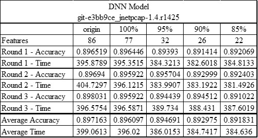
  
  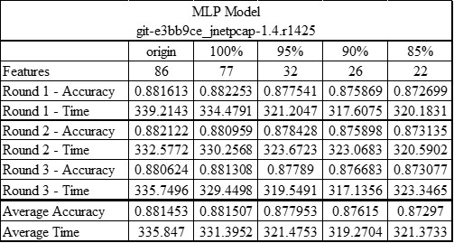

## git-e3bb9ce_jnetpcap-1.3.0_patch
Latest Commit Date: Mon Jul 25 22:30:07 2022 +0200

  
  
  
  
  
  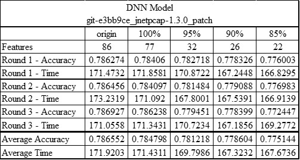
  
  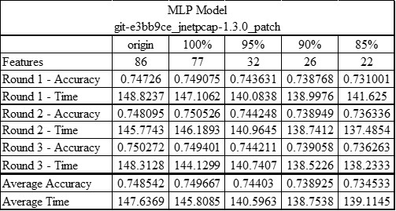

## git-e3bb9ce_jnetpcap-1.3.0
Latest Commit Date: Mon Jul 25 22:30:07 2022 +0200

  
  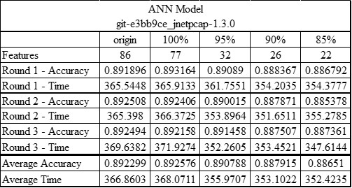
  
  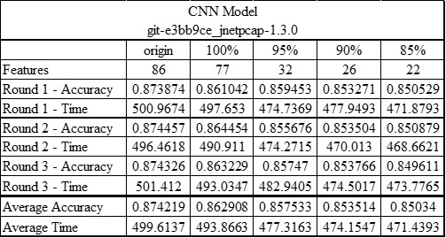
  
  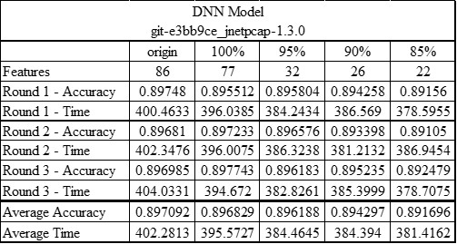
  
  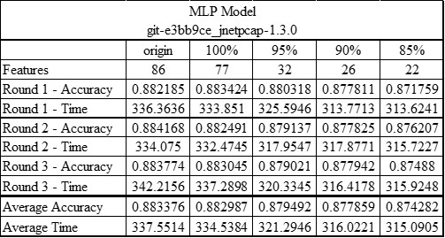

## git-f6d5aac_jnetpcap-1.4.r1425_patch
Latest Commit Date: Tue Apr 19 17:29:45 2022 +0200

  
  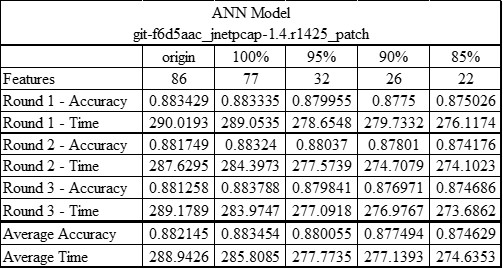
  
  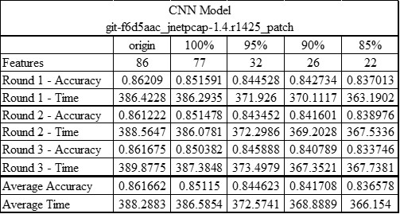
  
  
  
  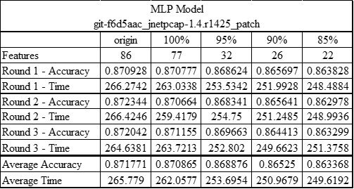

## git-f6d5aac_jnetpcap-1.4.r1425
Latest Commit Date: Tue Apr 19 17:29:45 2022 +0200

  
  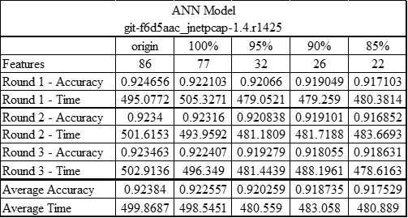
  
  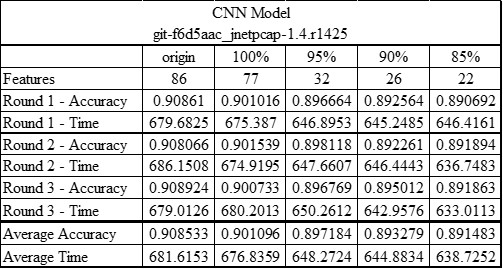
  
  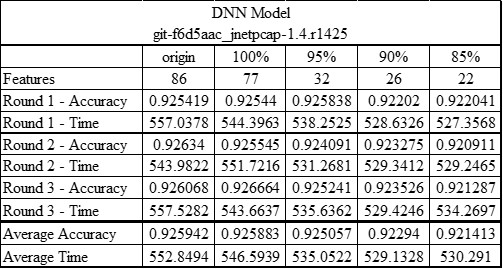
  
  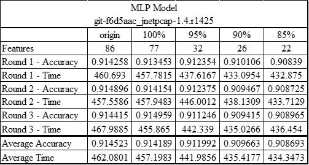

## git-f6d5aac_jnetpcap-1.3.0_patch
Latest Commit Date: Tue Apr 19 17:29:45 2022 +0200

  
  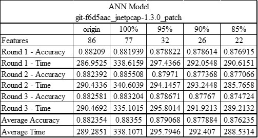
  
  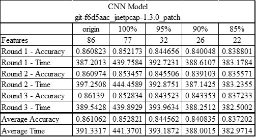
  
  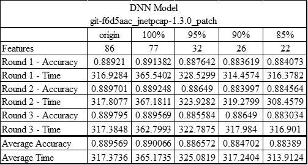
  
  

## git-f6d5aac_jnetpcap-1.3.0
Latest Commit Date: Tue Apr 19 17:29:45 2022 +0200

  
  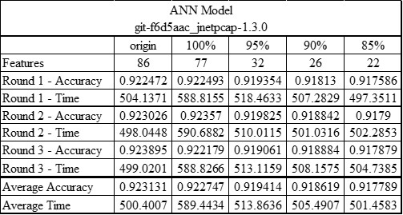
  
  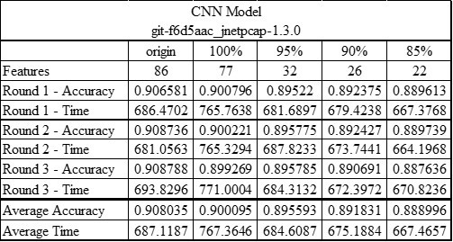
  
  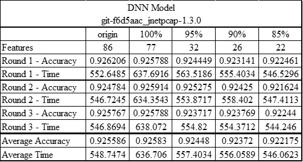
  
  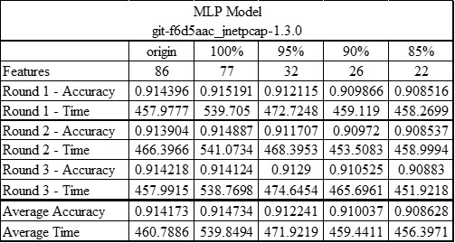

## git-98a5eba_jnetpcap-1.4.r1425
Latest Commit Date: Wed Jan 5 10:41:44 2022 -0500

  
  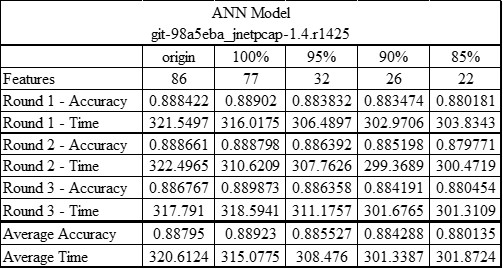
  
  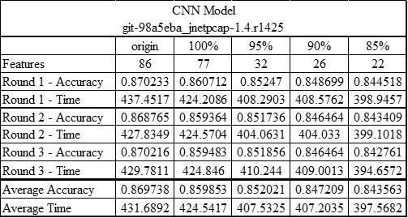
  
  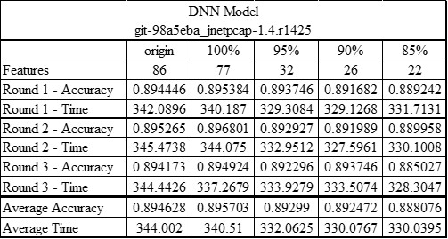
  
  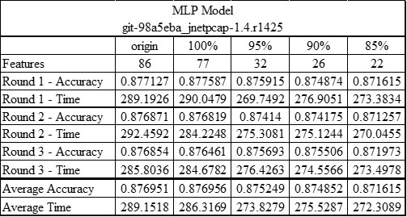

## git-98a5eba_jnetpcap-1.3.0
Latest Commit Date: Wed Jan 5 10:41:44 2022 -0500

  
  
  
  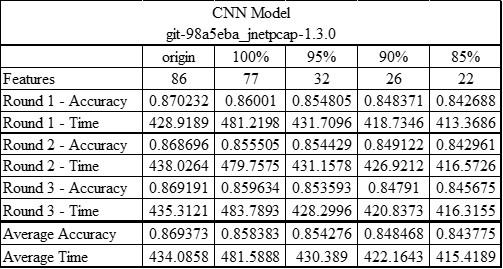
  
  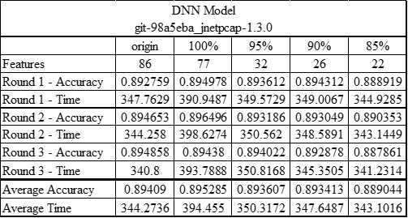
  
  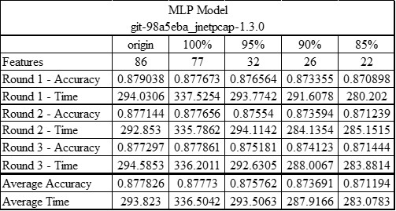

